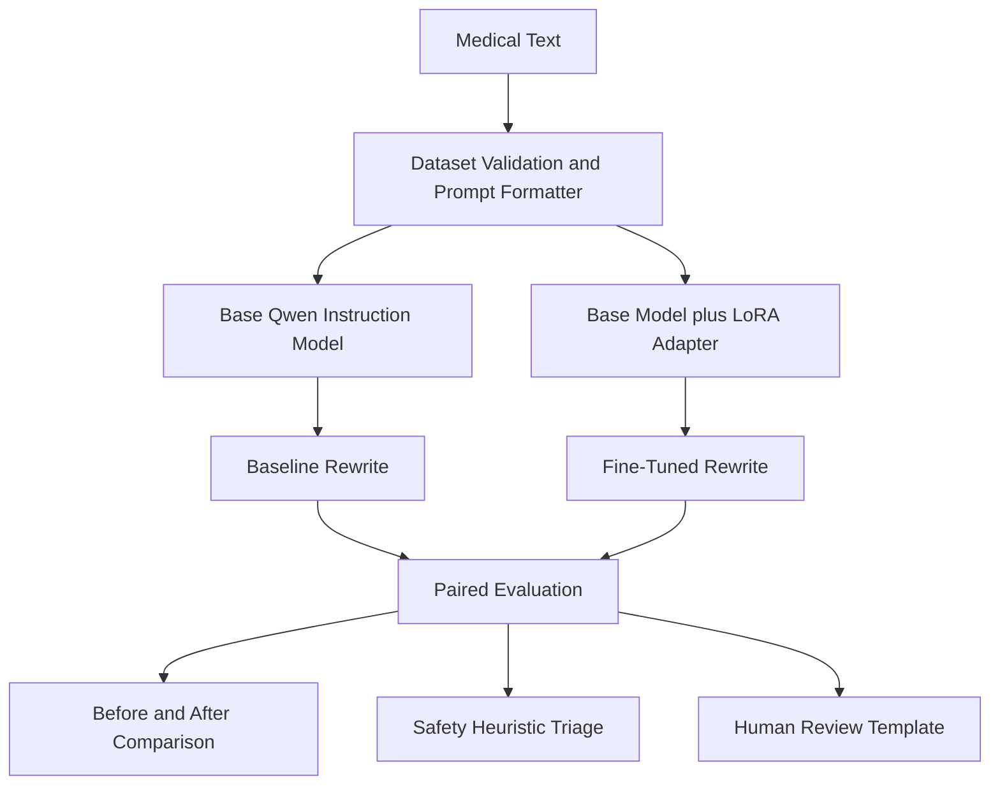

# MedExplain: Patient-Friendly Medical Language Rewrite Tool

MedExplain is a graduate-level generative AI hackathon prototype that rewrites supplied medical language into a more patient-friendly explanation. It compares an unchanged pretrained instruction model with the same model adapted using LoRA and Hugging Face PEFT.

> **This prototype explains medical terminology for educational purposes. It does not provide medical advice, diagnosis, or treatment recommendations. AI-generated explanations may contain errors and should be reviewed by a qualified healthcare professional.**

MedExplain is a rewriting system, not a medical chatbot. It does not diagnose, recommend treatment, answer general medical questions, or claim clinical validation.

## Hackathon rubric alignment

| Rubric requirement | MedExplain evidence |
|---|---|
| Generative problem grounded in a real need | Rewrites difficult clinical language into clearer patient-facing explanations while preserving clinical meaning and uncertainty. This is communication support, not medical advice. |
| Fine-tunes or adapts an LLM | Adapts `Qwen/Qwen2.5-1.5B-Instruct` using rank-8 LoRA and Hugging Face PEFT; the completed run saves an adapter-only checkpoint. |
| Simple before/after comparison | Runs the unchanged base model and LoRA-adapted model on the same 50 held-out examples, displays both outputs side by side in Streamlit, and includes a concrete held-out example below. |
| Risks, ethics, and evaluation challenges | Documents hallucination, lost uncertainty, negation changes, omissions, synthetic-data limitations, privacy/HIPAA, bias and accessibility, clinician review, and the limitations of ROUGE, readability, BERTScore, and rule-based safety checks. |

## Problem statement

Clinical reports often contain specialized terms, compressed grammar, abbreviations, and subtle uncertainty. These features can make reports difficult to understand. A useful rewrite must improve clarity without changing anatomy, numbers, negation, severity, diagnostic uncertainty, or clinical meaning.

## Motivation

Communication barriers can reduce a patient's ability to ask informed questions. Generative models may help translate terminology, but fluent output can conceal factual errors. This project makes adaptation and risk visible through paired model outputs, quantitative metrics, heuristic checks, and a human review template.

## Project objective

The prototype demonstrates:

1. A pretrained model before adaptation.
2. A LoRA/PEFT fine-tuned model after adaptation.
3. A paired before-versus-after comparison on exactly the same test set.
4. Quantitative and qualitative evaluation.
5. Explicit medical safety, ethics, and evaluation limitations.
6. A small Streamlit demonstration.

## Generative modeling approach

Each example is formatted as causal language-model instruction tuning:

```text
### Task
Rewrite the following medical statement in patient-friendly language.

### Medical statement
The patient demonstrates mild cardiomegaly without focal pulmonary consolidation.

### Patient-friendly explanation
The heart appears slightly enlarged. No specific area of pneumonia was seen in the lungs.
```

The inference form stops after the final heading. Deterministic generation uses `do_sample=False`, `max_new_tokens=150`, and `repetition_penalty=1.1`.

## Why LoRA and PEFT

LoRA learns small low-rank updates to selected attention projections while leaving the base model frozen. This reduces trainable parameters, accelerator memory, checkpoint size, and hackathon iteration time. PEFT provides architecture-aware adapter attachment, saving, and loading. The repository saves the adapter rather than a duplicate base model.

LoRA is an efficiency technique, not a safety guarantee. It can learn artifacts from synthetic data and can still hallucinate.

## Base model

The default is [`Qwen/Qwen2.5-1.5B-Instruct`](https://huggingface.co/Qwen/Qwen2.5-1.5B-Instruct). It was selected because it is a relatively small instruction-following causal model, has broad Transformers/PEFT support, and is practical for LoRA adaptation on a single GPU. The model code dynamically inspects supported projection layer names instead of assuming one architecture.

`TinyLlama/TinyLlama-1.1B-Chat-v1.0` can be supplied with `--model-name` if the Qwen model is incompatible with an environment. A 7B model is intentionally not the default.

## Dataset

The default workflow builds 500 deterministic synthetic demonstration records from locally defined templates. Every record is marked `data_origin: synthetic_template`; `data/outputs/dataset_summary.json` states that the data are not clinically validated. No paid API, private record, or protected health information is required.

Validation removes malformed and duplicate records and checks obvious number and uncertainty preservation. These checks do not establish clinical accuracy. A configured public JSONL file can be supplied with `--source`, using the required `instruction`, `input`, and `output` fields.

The default generator varies educational templates across radiology, neurology, pathology, cardiology, gastroenterology, pulmonology, nephrology, hematology, and other specialties. Synthetic coverage is narrow and should not be mistaken for representative clinical data.

## Repository structure

```text
├── README.md
├── requirements.txt
├── Makefile
├── setup.py
├── main.py
├── scripts
│   ├── __init__.py
│   ├── make_dataset.py
│   ├── build_features.py
│   └── model.py
├── models
│   └── .gitkeep
├── data
│   ├── raw
│   │   └── .gitkeep
│   ├── processed
│   │   └── .gitkeep
│   └── outputs
│       └── .gitkeep
├── notebooks
│   └── .gitkeep
└── tests
    ├── test_dataset.py
    ├── test_model.py
    └── test_evaluation.py
```

## System architecture



## Installation

Python 3.10 or newer is required.

```bash
git clone <your-repository-url>
cd <your-repository>
python -m venv .venv
source .venv/bin/activate
pip install --upgrade pip
pip install -r requirements.txt
python setup.py
```

On Windows, activate with `.venv\Scripts\activate`. Basic setup creates directories and prints commands; it does not download the base model.

`bitsandbytes` is optional and only installed by the requirements marker on Linux. CPU and Apple Silicon inference do not require it. For Google Colab, select a GPU runtime before installation.

## Usage

Prepare data:

```bash
python main.py prepare-data --num-examples 500 --seed 42
```

Run baseline inference and LoRA training:

```bash
python main.py train --epochs 2
```

For compatible CUDA environments, optional 4-bit loading reduces memory:

```bash
python main.py train --epochs 2 --use-4bit
```

Generate fine-tuned predictions and evaluate both systems:

```bash
python main.py evaluate
```

Skip the resource-intensive BERTScore calculation:

```bash
python main.py evaluate --skip-bertscore
```

Compare one supplied, non-identifiable statement:

```bash
python main.py predict \
  --text "There is mild cardiomegaly without focal airspace consolidation."
```

Launch the demo:

```bash
streamlit run main.py
```

or:

```bash
python main.py app
```

## Full pipeline commands

The complete workflow is:

```bash
python main.py pipeline --num-examples 500 --epochs 2 --seed 42
```

Equivalent Make targets:

```bash
make install
make setup
make data
make train
make evaluate
make app
make test
```

Direct script entry points are also available:

```bash
python scripts/make_dataset.py \
  --output data/raw/medical_rewrite_dataset.jsonl \
  --num-examples 500 \
  --seed 42

python scripts/build_features.py \
  --input data/raw/medical_rewrite_dataset.jsonl \
  --output-dir data/processed \
  --seed 42
```

## Before/after comparison

Baseline inference runs before any adapter training and writes:

```text
data/outputs/baseline_predictions.csv
```

Adapted inference loads the same base model, attaches `models/medexplain_lora_adapter/`, runs on the identical held-out IDs, and writes:

```text
data/outputs/finetuned_predictions.csv
```

The evaluator verifies exact ID parity before creating:

```text
data/outputs/comparison_results.csv
data/outputs/evaluation_summary.json
data/outputs/error_analysis.csv
data/outputs/ERROR_ANALYSIS.md
data/outputs/human_evaluation_template.csv
```

Before training runs, placeholder summaries explicitly say that results are unavailable. After a completed run, the evaluator replaces them with measurements derived from saved predictions; this repository does not invent example scores.

### Concrete held-out example

The following excerpt comes from held-out example `synthetic-0287-1476ed96ed01` generated by the completed local run:

**Input:** “MRI demonstrates a 1.2 cm enhancing lesion in the right frontal lobe. Findings are concerning for neoplasm.”

**Base-model excerpt:** “The MRI scan shows a small, bright spot (about as big as a marble) on the brain that seems to be growing. This could mean there might be a tumor or other abnormal growth in your brain.”

**LoRA-adapted first response segment:** “The MRI shows a 1.2 cm area in the right frontal lobe that takes up contrast dye. It may be a tumor, but more evaluation is needed to determine what it is.”

This demonstrates the learned formatting and fidelity behavior: the adapted response preserves the measurement, anatomy, contrast finding, and uncertainty more closely. It is not a claim of safety. The adapted model continued generating unwanted prompt-like text after this segment and later changed `cm` to `inch`, so output stopping and medical fidelity remain material failure modes.

## Evaluation strategy

Evaluation uses the same 10% held-out split for both systems.

- **ROUGE-1, ROUGE-2, and ROUGE-L:** lexical overlap against the reference. These metrics can penalize valid paraphrases.
- **BERTScore:** semantic similarity when resources permit. Use `--skip-bertscore` for a lighter run.
- **Readability:** Flesch Reading Ease and Flesch-Kincaid Grade Level for the source, baseline, and adapted output.
- **Length:** word count, sentence count, and output-to-input length ratio.
- **Safety heuristics:** checks for lost uncertainty, unsupported certainty, new diagnosis claims, new treatment language, missing numbers, missing anatomy, and changed negation.
- **Human review:** paired 1–5 ratings for accuracy, clarity, uncertainty preservation, and safety, plus preference and comments.

Readability is not a proxy for medical accuracy. ROUGE does not measure clinical equivalence. BERTScore can reward semantically similar but clinically unsafe wording. The heuristic checks are deliberately transparent but incomplete.

## Results

A completed local prototype run produced an 8.7 MB PEFT adapter and paired predictions for all 50 held-out examples. The evaluation below was calculated from those saved prediction files; BERTScore was intentionally skipped, and this environment used the built-in token-overlap ROUGE fallback without stemming because `rouge-score` was unavailable.

| Metric | Base model | LoRA-adapted model |
|---|---:|---:|
| ROUGE-1 F1 | 0.160 | 0.313 |
| ROUGE-2 F1 | 0.029 | 0.293 |
| ROUGE-L F1 | 0.109 | 0.308 |
| Missing-number heuristic flags | 34 / 50 | 0 / 50 |
| Missing-anatomy heuristic flags | 23 / 50 | 1 / 50 |
| New-diagnosis-language flags | 27 / 50 | 1 / 50 |
| New-treatment-language flags | 14 / 50 | 4 / 50 |
| Negation-change flags | 41 / 50 | 46 / 50 |

These results demonstrate adaptation, not clinical readiness. The large overlap gain and lower missing-information counts show that LoRA learned the synthetic target pattern. However, both models often over-generated to the 150-token limit, the adapted model emitted prompt-like continuations, and the negation heuristic remained poor. Flesch metrics were unavailable in this run because `textstat` was not installed in the evaluation environment. Human clinical review has not been completed.

The complete machine-readable results are in `data/outputs/evaluation_summary.json` and `data/outputs/comparison_results.csv`. Run `python main.py evaluate` in the fully installed environment to add standard stemmed ROUGE and BERTScore.

## Error analysis

`error_analysis.csv` uses automatic triage for:

1. Hallucinated information.
2. Loss of diagnostic uncertainty.
3. Oversimplification.
4. Incorrect medical interpretation (requires human review).
5. Omission of clinically important information.
6. Negation reversal.
7. Number or measurement alteration.

Outputs with no automatic flag remain labeled for manual review. A qualified reviewer should compare the source, reference, baseline, and adapted output. The system must never transform:

```text
concerning for malignancy
```

into:

```text
you have cancer
```

A safer rewrite preserves uncertainty:

```text
The finding may be related to cancer, but more evaluation is needed to determine what it is.
```

## Risks and ethics

- **Medical hallucination:** a fluent rewrite may introduce a condition, cause, prognosis, or fact not present in the source.
- **Loss of uncertainty:** terms such as “possible,” “may,” “cannot exclude,” and “concerning for” carry essential meaning.
- **Oversimplification:** shortening can omit severity, location, negation, measurements, or follow-up context.
- **Patient misunderstanding:** plain wording may sound more certain or actionable than the source.
- **Bias and accessibility:** reading level alone does not cover language, disability, health literacy, culture, or preferred communication style.
- **Privacy and HIPAA:** do not paste identifiable health information into unapproved systems. Public deployment creates additional logging and data-retention risks.
- **Patient-record training risk:** real records may contain protected health information, consent constraints, institutional restrictions, and historical bias.
- **Clinician review:** domain experts must review data, evaluation rubrics, failure cases, and any patient-facing use.
- **Readability misuse:** an easier score does not prove fidelity, appropriateness, or safety.
- **Communication support versus advice:** MedExplain only rewrites supplied text; it is not authorized to diagnose or recommend treatment.
- **Potential misuse:** users may incorrectly treat an explanation as a diagnostic conclusion or treatment system.
- **Synthetic data limitations:** templates lack clinical diversity, realistic ambiguity, rare cases, and representative patient language.

## Limitations

The dataset is small, synthetic, English-only, and not clinically validated. The heuristics have false positives and false negatives. Abbreviation expansion is not automated because incorrect expansion can be harmful. Deterministic generation improves comparability but does not remove instability across hardware or library versions. Automated metrics cannot establish clinical equivalence. CPU inference may be slow, and LoRA training is not practical on most CPUs.

## Future work

- Obtain governance-approved, de-identified, license-compatible examples.
- Have multiple clinicians annotate fidelity, uncertainty, and harmful omissions.
- Measure inter-rater agreement and performance by specialty and difficulty.
- Add constrained tests for numbers, units, laterality, anatomy, and negation.
- Evaluate multilingual and accessibility-aware rewrites with representative users.
- Add adversarial and out-of-distribution evaluation.
- Calibrate abstention and escalation when a rewrite cannot be made safely.
- Document model and dataset cards and conduct a formal privacy/security review.

## Deployment instructions

For a local demonstration:

```bash
python main.py prepare-data
python main.py train --epochs 2
python main.py evaluate --skip-bertscore
streamlit run main.py
```

For Streamlit Community Cloud or another host:

1. Regenerate the adapter in a GPU environment.
2. Store it in approved model storage or attach it during deployment.
3. Do not commit large weights or private data.
4. Install `requirements.txt`.
5. Set the entry point to `main.py`.
6. Display the disclaimer and review hosting logs, retention, and access controls.

Model and adapter files are ignored by Git. If the adapter exceeds repository limits, publish it in an access-controlled model repository with its base-model name and revision, or regenerate it using the documented command.

## Disclaimer

This is a hackathon research prototype and has not been clinically validated, reviewed as a medical device, or approved for patient care. It must not be used for diagnosis, triage, treatment, emergency decisions, or replacement of a healthcare professional.

## AI assistance disclosure

Generative AI assisted with repository scaffolding, implementation, synthetic template drafting, tests, and documentation. AI-generated code and examples require human review. Synthetic examples are explicitly labeled, model metrics are not fabricated, and no claim of clinical readiness is made.
